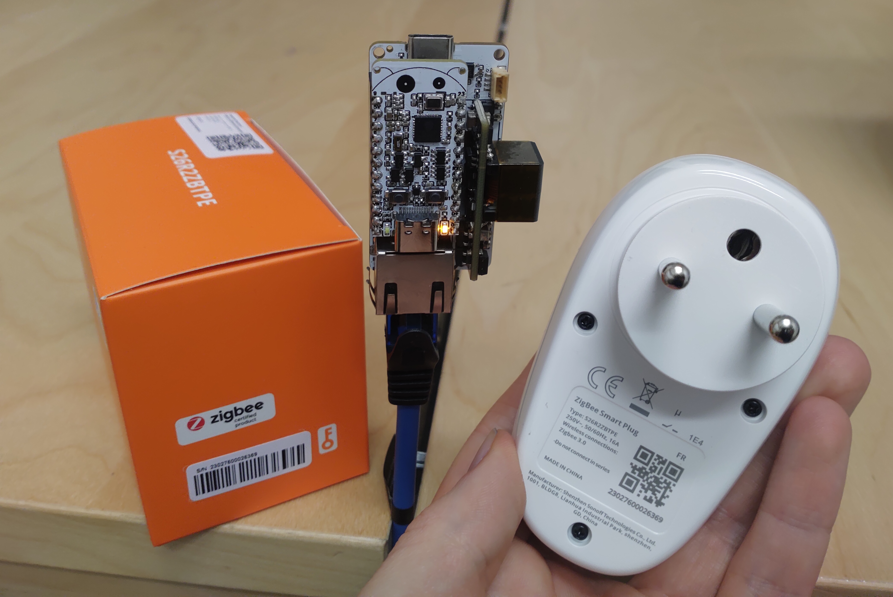
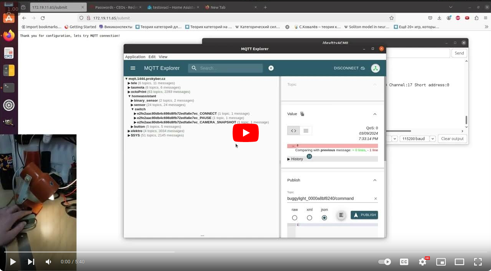

# Esp32-C6-Bug-Arduino-Examples
Hello Internet traveller!
You have just arrived to the repository containing Arduino code examples for Esp32-C6-Bug and Esp32-Eth-Bug development boards.
## Arduino IDE support
The official Arduino support for the Esp32-C6 chip is now ready (check out arduino-esp32 version 3.0.0). To install it you should insert index.json link([Stable](https://espressif.github.io/arduino-esp32/package_esp32_index.json) or [Development](https://espressif.github.io/arduino-esp32/package_esp32_dev_index.json)(Supports Esp32-C6 as of 5.2.2024)) taken from [the official docs](https://docs.espressif.com/projects/arduino-esp32/en/latest/installing.html)
Into the preferences tab of Arduino IDE. After it's done the core will be available to download via Boards Manager.
Some examples are covered more in details in [Esp32-C6-Bug datasheet](https://github.com/allexoK/Esp32-C6-Bug-Docs/blob/main/esp32c6bugdatasheet.pdf)
When compiling the examples ensure that:
- The Board option in tools tab is set to 'ESP32C6 Dev Module'
- USB CDC On Boot option in tools tab is set to 'True'
- Port option in tools tab is set to the port, where you connected your board.
## Quick examples description
### esp32c6bugblink 
The first example demonstrates the basic blinking functionality, nothing fancy, but a good way to start. 
    - Parts needed:
        - Esp32-C6-Bug
### esp32c6bugethernet
The second example utizes the Ethernet to connect to the Internet, use it to ensure that Esp32-Bug-Eth is working.
    - Parts needed:
        - Esp32-C6-Bug
        - Esp32-Bug-Eth
### esp32c6bugplusSH1106_128x64_i2c_QTPY
For this example, you will need some kind of OLED display based around SH1106 driver. If it has Stemma QT connector you can connect it to Esp32-Bug-Eth via it(Alternatively just connect display SDA->pin 21, display SCL->pin 20). The code prints basic 'hello world' style message.  
- Parts needed:
    - Esp32-C6-Bug
    - Some Oled with SH1106 driver
    - optional: Esp32-Bug-Eth
### esp32c6bugethernetbmp280telegrambot
This example is more advanced and more 'open-ended,' but it is my personal favorite. It uses Ethernet to connect to the Internet, reads data from a BMP280 sensor (which you can later replace with any other sensor or combination of sensors), and sends it to you via Telegram messenger if the data exceeds a certain limit (temperature range: 20-30 °C). You can follow [this](https://randomnerdtutorials.com/telegram-control-esp32-esp8266-nodemcu-outputs/) tutorial to obtain the Telegram token and Chat ID defined in the code.
I personally love this example because I see it as a stepping stone to some interesting experiments. Imagine a group of sensors 'writing' data to a Telegram chat, and an AI like ChatGPT reading the sensor data from the chat and commanding other IoT devices to perform actions (like issuing an 'open the window' command via the same chat). Can it handle the data like this? Will it open the window if the temperature is too hot? What is the maximum number of 'inputs' and 'outputs' it can handle? No one knows since the technology is quite new. Maybe you will be the first person to find out?
- Parts needed:
    - Esp32-C6-Bug
    - BMP280 sensor(Something with Stemma QT works best)
    - Esp32-Bug-Eth

### esp32c6bugzigbeemqttbridge
The example demonstrates a simple Zigbee to MQTT bridge for light bulbs. The Esp32-C6-Bug+Esp32-Bug-Eth combo works as a Zigbee coordinator and a PoE-Powered Ethernet MQTT client. After the client receives a message from the broker on the 'test/light' topic, it turns on/off all the connected light bulbs. The example can be the first stepping stone for building an Esp32-C6-Bug Arduino Zigbee To MQTT Bridge! Don't forget to set your MQTT credentials in Zigbee_Mqtt_Light_Bridge.ino and **ensure that the partition scheme option in Tools tab is set to custom** . Also, you will need the Arduino core with Zigbee support (as of 24/02/2024, the support is already in the master branch).
- Parts needed:
    - Esp32-C6-Bugx2(Also tested with Sonoff s26r2zbtpe smart socket as End device)
    - Esp32-Bug-Eth

### esp32c6bugzigbeemqttbridgehassautodiscovery
This is an ugraded version of esp32c6bugzigbeemqttbridge.  To compile it you will also need the following libraries:
- LinkedList
- SPIFFs
- ArduinoJson

Additionally to the mentioned Zigbee to MQTT features from the previous example, the following functionality was implemented:
- Home assistant auto-discovery. All the found devices are now published to MQTT (you can also use this functionality to find out their command/state MQTT topics to control via Node RED for example)
- MQTT configuration via web server running on the bridge.(Hold the button untill the onboard LED starts blinking fast) Configuration is saved to internal file system and persists after reboot.
- Discovered Zigbee devices are now saved to internal file system. So the bridge remembers them even after the reset.
- Zigbee end-device switch report support implemented.
- Bridge status display via LED (Off=No Network, ON=Connected to MQTT, Fast blinking=Configuration mode, Slow blinking = connecting to MQTT)

[More about this example](https://hackaday.io/project/193049-esp32-c6-bug-esp32-bug-eth/log/228063-homeassistant-auto-discovery-for-the-home-brewed-zigbee-to-mqtt-bridge)

- Parts needed:
    - Esp32-C6-Bug
    - Esp32-Bug-Eth
    - Zigbee Smart socket/Zigbee Light bulb(Tested with Sonoff s26r2zbtpe smart socket as End device)

### esp32c6bugsim7080ggpsanddebug
To compile it you will also need the following libraries:
- TinyGSM

These two examples demonstrate some basic Esp32-C6-Bug communication with SIM7080G Multi-Band CAT-M(eMTC)/NB-IoT/GNSS module. After ATDebug example is flashed, the commands sent via Esp32-C6-Bug are resend to SIM7080G, which is usefull for debug purposes. GPSExample demonstrates GPS functionaloty of SIM7080G. Ensure that GPS antenna is outside, so it can receive signal. 

- Parts needed:
    - Esp32-C6-Bug
    - Any board with Sim7080G module

### esp32c6bugawsmqttwifi
This basic example demonstrates Esp32-C6-Bug connection to Amazon AWS IoT Core. Nothing fancy just connection and publishing of the dummy data. The example is heavily based on this [great video](https://youtu.be/idf-gGXvIu4?si=hLH2Tkli5HUsZhBz). I was initially planning to connect via Sim7080G, but ssl configuration on Sim7080g hit me good, hopefully I will get it running some time later. 
Some preparations to be done beforehand:
- Configure Amazon IoT core, note the endpoint address
- create Amazon 'thing' and generate SSL certificates.
- Set downloaded certificates into secrets.h file
- Set your Wifi credentials and thing name in secrets.h file
- Set aws endpoint in secrets.h file
- Flash the code.

- Parts needed:
    - Esp32-C6-Bug

### esp32c6bugawsmqttsim
This example demonstrates Esp32-C6-Bug connection to Amazon AWS IoT Core using SIM7080G module. Use [VeriSign-Class 3-Public-Primary-Certification-Authority-G5 certificate](https://www.digicert.com/kb/digicert-root-certificates.html) as root CA.

Some preparations to be done beforehand:
- Configure Amazon IoT core, note the endpoint address
- create Amazon 'thing' and generate SSL certificates.
- Set downloaded certificates in certs folder
- Set aws endpoint in the code, and remove '-ats' from endpoint URL(more about it in comments in the code).
- Set SIM card pincode in the code
- Flash the code.

- Parts needed:
    - Esp32-C6-Bug
    - Esp32-Bug-Sim shield

## ESP-IDF examples
If you are also interested in advanced features of Esp32-C6 like Zigbee and thread please refer to [Official examples](https://github.com/espressif/esp-idf/tree/release/v5.1/examples) and to Demos section of [Esp32-C6-Bug datasheet](https://github.com/allexoK/Esp32-C6-Bug-Docs/blob/main/esp32c6bugdatasheet.pdf) 
